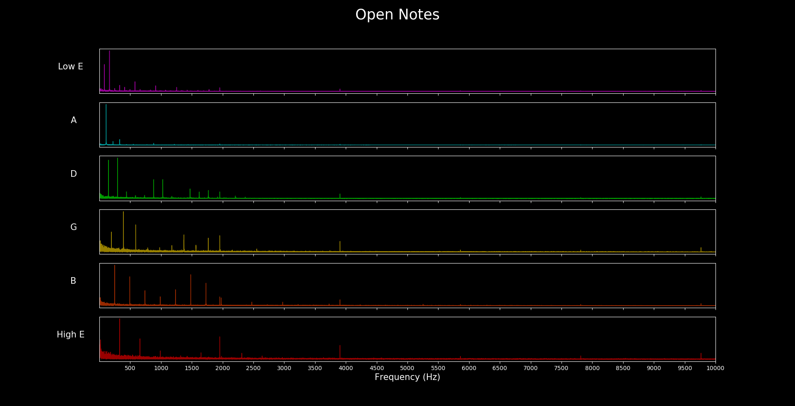
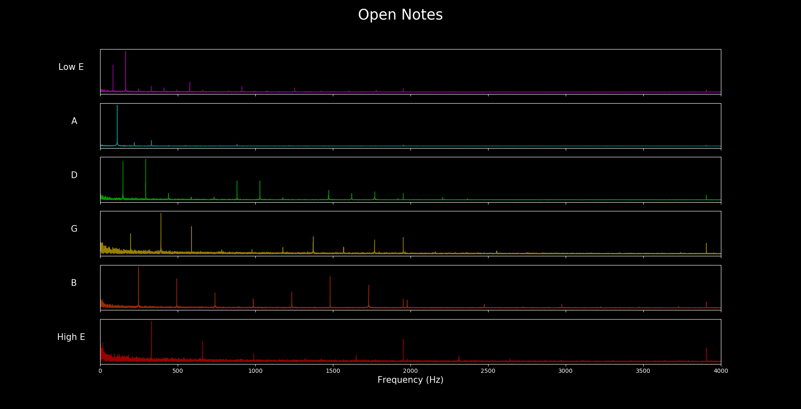

# guitar-fourier-transform

Using matlab and a microphone on a headset, audio was recorded and the Fourier transform was performed on the audio data. The data was then exported in a CSV file. In Python, the data was processed and the graphs created. It is interesting to see the relative amplitudes of the overtones. On the low e string, the second harmonic (first overtone) actually has a higher amplitude that the fundamental.

The picture below is with a smaller x axis scale so that the graph is easier to read.

